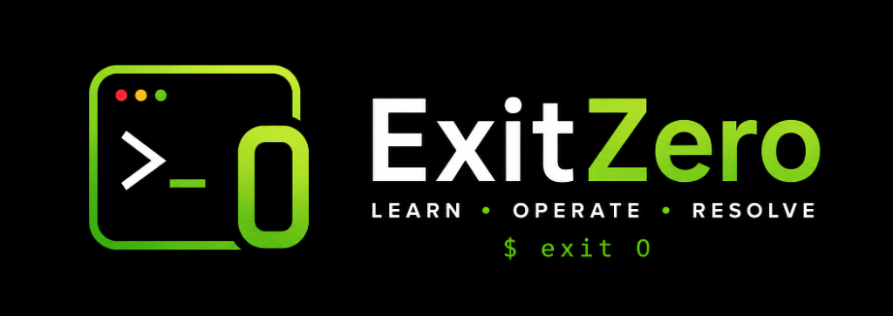

<p align="center">
  
</p>

# ExitZero 💻

> **`$ exit 0` — Premium DevOps Study Console & Operational Runbooks.**

ExitZero is a developer-native, high-performance study engine and troubleshooting catalog built for DevOps and Site Reliability Engineers. Styled to feel like GitHub, VS Code, and Warp Terminal.

[](https://srinivassarkar.github.io/ExitZero)


---

## Workspaces

ExitZero is structured into three dedicated workspaces accessible via the sidebar or channel switcher (`T`):

### 1. 🗂️ Interview Prep
* **SM-2 Spaced Repetition**: Dynamic queue ordering (overdue cards first, active unseen cards, future reviews) based on recall intervals (`Again`, `Good`, `Easy`).
* **6 Domains (600+ Questions)**: Docker, Kubernetes, AWS, Terraform, Jenkins, and Linux/DevOps.
* **Granular Scoping**: Practice individual submodules (e.g., K8s Networking, AWS IAM) or entire domains in an unconstrained queue.
* **Live Queue Counter**: Real-time position tracking (`1 / 100`) directly on the question card.

### 2. 📓 Operational Runbooks
* **6 On-Call Triage Playbooks**:
  * 🐧 **Linux**: Kernel panics, OOM killer, disk/inode exhaustion, zombie reaping.
  * 🔀 **Git**: Reflog recovery, detached HEAD, dangling commits, merge conflict resolution.
  * 🌐 **Network**: DNS failure, socket exhaustion, iptables/nftables, TCP RST triage.
  * 🐳 **Docker**: Daemon hang, rootfs corruption, bridge exhaustion, cgroup limits.
  * ☸️ **Kubernetes**: CrashLoopBackOff, etcd split-brain, pending pods, webhook timeouts.
  * 📄 **Terraform**: State locks, drift detection, state corruption rollback, untracked imports.
* **Dual-Pane Diagnostic Console**: Step-by-step triage commands, syntax maps, expected terminal output, and copy-paste runbook actions.

### 3. 🛡️ Incident Labs
* **Outage Simulation**: Interactive multiple-choice troubleshooting sandbox for debugging production incidents.

---

## App Flow

```
[ Topic Title / Press 'T' ] ──> Channel Selector Modal
                                  ├── Target Domain (Docker, K8s, AWS, etc.)
                                  │     ├── Practice Entire Domain (All Qs)
                                  │     └── Specific Subtopic Module
                                  ├── Operational Runbook (Linux, Git, K8s...)
                                  ├── Master Queue (All 600+ DevOps Questions)
                                  └── Bookmarked Questions

[ Study Console ] ──────────────> Question Card (Q# & live queue counter)
                                  ├── Show/Hide Answer (Code blocks & terminal syntax)
                                  ├── SM-2 Review (Again / Good / Easy) ──> Auto-advances in 800ms
                                  ├── Timer Mode (60s–180s countdown with auto-reveal)
                                  └── Heart (Save to Bookmarks)

[ Telemetry & Controls ] ───────> Header / Settings Popover
                                  ├── Streak Tracker (Consecutive study days + longest streak)
                                  ├── Daily Study Reminder (Scheduled hour + test alert trigger)
                                  ├── Difficulty Exclusions (Filter Easy / Medium / Hard)
                                  └── Sound, Haptics & Dark/Light Theme
```

---

## Key Features & Advantages

* **⚡ Offline-First PWA**: Zero network dependency after initial load. Complete question banks and runbooks work on subways, flights, or air-gapped systems.
* **🔒 100% Client-Side Privacy**: Zero cloud backend, telemetry tracking, or sign-ups. All SRS data, bookmarks, and streaks stay in local browser storage.
* **🔊 Synthesized Audio & Haptics**: Procedural audio generated via Web Audio API (0 external MP3 downloads) paired with tactile haptic vibration triggers.
* **⌨️ Keyboard-Driven Ergonomics**:
  * `Space` / `Enter`: Reveal Answer
  * `1` / `2` / `3`: Rate Card (`Again` / `Good` / `Easy`)
  * `←` / `→`: Previous / Next Question
  * `T`: Open Channel Selector Modal
  * `/`: Global Search (Fuzzy search powered by Fuse.js)
  * `Esc`: Close Modals
* **🔔 Reliable Study Reminders**: Active heartbeat and Service Worker push notifications keep review streaks consistent with an instant test trigger.

---

## Local Development

```bash
# Clone & install
git clone https://github.com/srinivassarkar/ExitZero.git
cd ExitZero
npm install

# Start development server
npm run dev

# Compile static release export (compiles to /out)
npm run build
```

---

## Tech Stack
* **Framework**: Next.js 15 (Static Export / Turbopack)
* **Styling**: Tailwind CSS v4 & Lucide Icons
* **Search**: Fuse.js (Client-side fuzzy search)
* **Audio**: Native Web Audio Synthesizer
* **Typography**: Inter & JetBrains Mono

---

<p align="center">Built by <a href="https://github.com/srinivassarkar">srinivassarkar</a> &nbsp;·&nbsp; <code>$ exit 0</code></p>
